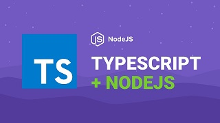

# TypeScript Concepts

<h1 align="center">
    
</h1>

# Index
- 📑[About](#-About)
- 💻[Technologies Used](#-technologies-used)
- 💾[How clone this project?](#-how-clone-this-project?)

## 📑About
This project is one application created in **Bootcamp GoStack**, with purpose in improve my skills in **TYPESCRIPT**.  

---

## 💻Technologies used

This project was developed using:

- NodeJS
- TypeScript
- Express
- Yarn

---

## 💾How clone this project?

```bash 

    # Clone the repository
    $ git clone https://github.com/TomasSantosz/TypeScript-Concepts.git

    # Enter directory
    $ cd TypeScript-Concepts

    # Install dependencies
    $ yarn

    # Generate JavaScript
    $ yarn tsc  

```

---
### Developer Tomás Santos
###  Github: https://github.com/TomasSantosz
### LinkedIn: https://www.linkedin.com/in/tom%C3%A1s-santos-3b9617167/